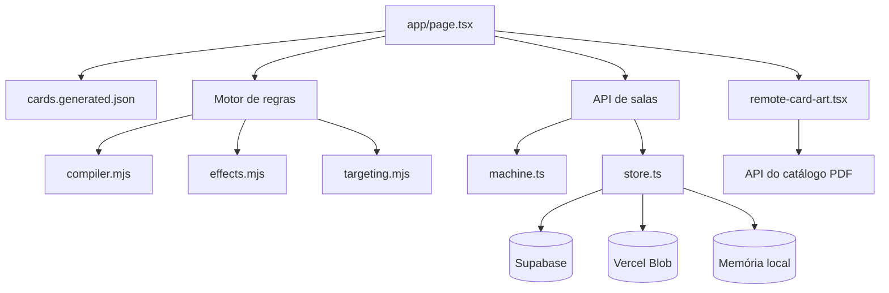

# Hemsfell Heroes

Jogo digital de cartas ambientado no universo Hemsfell, inspirado em jogos como Hearthstone, Legends of Runeterra, Magic: The Gathering Arena e Yu-Gi-Oh!.

O projeto oferece partidas contra IA e multiplayer por salas, seleção de heróis e decks, mulligan, energia principal e reserva, fases de turno, combate com escolha de defensor, janelas de resposta, evolução de heróis, Deck Extra de Imagens e um motor modular para custos, alvos, efeitos, gatilhos e palavras-chave.

- Aplicação em produção: https://hemsfell.dealradar.games/
- Repositório: https://github.com/Vanleef/Hemsfell-Heroes
- Branch oficial: `main`
- Branch ativa de mecânicas: `fix/cards_mechanics`
- Catálogo visual: PDF configurado no servidor e renderizado sob demanda pelo cliente

> O jogo continua em desenvolvimento. Mudanças de regra devem ser acompanhadas por testes automatizados no motor de regras.

## Sumário

1. [Tecnologias](#tecnologias)
2. [Requisitos](#requisitos)
3. [Como executar localmente](#como-executar-localmente)
4. [Variáveis de ambiente](#variáveis-de-ambiente)
5. [Comandos disponíveis](#comandos-disponíveis)
6. [Arquitetura](#arquitetura)
7. [Estado e fluxo de uma partida](#estado-e-fluxo-de-uma-partida)
8. [Motor de regras](#motor-de-regras)
9. [Cartas e catálogo](#cartas-e-catálogo)
10. [Multiplayer](#multiplayer)
11. [Artes das cartas](#artes-das-cartas)
12. [Testes e simulações](#testes-e-simulações)
13. [Como implementar cartas e mecânicas](#como-implementar-cartas-e-mecânicas)
14. [Deploy](#deploy)
15. [Diagnóstico de problemas](#diagnóstico-de-problemas)
16. [Boas práticas para contribuição](#boas-práticas-para-contribuição)

## Tecnologias

- Next.js 16 com App Router
- React 19
- TypeScript
- Node.js 22
- Motor de regras em módulos JavaScript ESM
- PDF.js para renderização das cartas
- Supabase REST ou Vercel Blob para persistência das salas
- Armazenamento em memória durante desenvolvimento
- Node Test Runner para testes automatizados
- Vinext/Vite e Cloudflare como pipeline alternativo
- GitHub Actions para testes e build contínuos

## Requisitos

Instale:

- Node.js `22.13.0` ou superior
- npm compatível com o Node instalado
- Git
- Bash para os scripts auxiliares do projeto

Verifique o ambiente:

```bash
node --version
npm --version
git --version
```

No Windows, prefira Git Bash ou WSL para executar scripts `.sh`. O servidor Next.js também pode ser iniciado normalmente pelo PowerShell com `npm run dev`.

## Como executar localmente

### 1. Clonar o repositório

```bash
git clone https://github.com/Vanleef/Hemsfell-Heroes.git
cd Hemsfell-Heroes
```

### 2. Selecionar a branch

Para usar a versão oficial:

```bash
git switch main
git pull origin main
```

Para trabalhar nas mecânicas em desenvolvimento:

```bash
git switch fix/cards_mechanics
git pull origin fix/cards_mechanics
```

### 3. Instalar dependências

Para desenvolvimento local:

```bash
npm install
```

Para uma instalação reproduzível baseada no `package-lock.json`:

```bash
npm ci
```

O script `npm run install:ci` pertence ao pipeline Vinext/Sites e valida cache, integridade e ambiente Linux. Para o desenvolvimento comum, `npm install` ou `npm ci` são suficientes.

### 4. Configurar o ambiente

Crie `.env.local` na raiz. Para jogar contra IA, nenhuma integração externa é obrigatória.

Configuração mínima para desenvolvimento:

```dotenv
HEMSFELL_ROOM_STORE=memory
```

### 5. Iniciar o servidor

```bash
npm run dev
```

Abra:

```text
http://localhost:3000
```

O comando executa `next dev -H 0.0.0.0`, permitindo acesso pela máquina local e, quando a rede/firewall permitirem, por outros dispositivos da rede.

### 6. Validar antes de enviar alterações

```bash
npm run test:rules
npm run vercel-build
```

Para a validação mais ampla do pipeline alternativo:

```bash
npm test
```

## Variáveis de ambiente

Nunca commite chaves reais. Use `.env.local` localmente e configure Production, Preview e Development separadamente na Vercel.

| Variável | Obrigatória | Uso |
| --- | --- | --- |
| `HEMSFELL_ROOM_STORE` | Em desenvolvimento | Use `memory` para salas efêmeras locais. |
| `SUPABASE_URL` | Produção com Supabase | URL do projeto Supabase. |
| `SUPABASE_SERVICE_ROLE_KEY` | Produção com Supabase | Chave privada usada apenas no servidor. Nunca exponha no cliente. |
| `SUPABASE_SECRET_KEY` | Alternativa | Nome alternativo aceito pelo armazenamento. |
| `BLOB_READ_WRITE_TOKEN` | Produção com Blob | Token do Vercel Blob usado quando Supabase não está configurado. |
| `NEXT_PUBLIC_SUPABASE_URL` | Somente se necessário no cliente | Não substitui `SUPABASE_URL` no armazenamento de salas. |
| `NEXT_PUBLIC_SUPABASE_ANON_KEY` | Somente recursos públicos | Chave anônima; não use como service role. |

Ordem de armazenamento das salas:

1. Memória, quando `NODE_ENV=development` ou `HEMSFELL_ROOM_STORE=memory`.
2. Supabase, quando URL e chave privada estão configuradas.
3. Vercel Blob, quando `BLOB_READ_WRITE_TOKEN` está configurado.
4. Erro explícito em produção quando nenhum armazenamento durável está disponível.

## Comandos disponíveis

| Comando | Descrição |
| --- | --- |
| `npm run dev` | Inicia o Next.js em desenvolvimento na porta 3000. |
| `npm run vercel-build` | Executa testes de regras e o build nativo do Next.js. |
| `npm run test:rules` | Executa a suíte principal do motor de regras. |
| `npm run test` | Executa build verificado e todos os arquivos `tests/*.test.mjs`. |
| `npm run build` | Executa o build Vinext limitado por timeout e valida o artefato. |
| `npm run lint` | Executa ESLint pelo ambiente auxiliar do projeto. |
| `npm run audit:cards` | Audita cobertura e classificação das cartas. |
| `npm run simulate:headless` | Executa simulações sem interface. |
| `npm run dev:vinext` | Inicia o pipeline Vite/Vinext alternativo. |
| `npm run check:vinext` | Valida compatibilidade com Vinext. |
| `npm run db:generate` | Gera artefatos Drizzle do banco alternativo. |
| `npm run validate:artifact` | Valida o resultado produzido pelo pipeline de build. |

## Arquitetura

### Visão geral



### Arquivos e responsabilidades

#### Interface e orquestração

- `app/page.tsx`: tela principal, estado visual, setup, IA, tabuleiro, mão, fases, animações, seleção de alvos, decisões do motor e sincronização online.
- `app/lab.css`: layout do tabuleiro, cartas, tooltips, estados visuais, combate, janelas de resposta e animações.
- `app/layout.tsx`: layout raiz do Next.js.
- `app/globals.css`: estilos globais e importação da folha principal.
- `app/remote-card-art.tsx`: carrega o PDF com PDF.js, guarda o documento e as páginas em cache e renderiza a página de cada carta em canvas.

`app/page.tsx` ainda contém lógica legada e integração visual em um arquivo grande. Novas regras devem preferencialmente entrar em `app/rules-engine/`; a página deve apenas coletar a intenção do jogador, mostrar decisões e renderizar o estado resultante.

#### Catálogo e ativação

- `app/cards.generated.json`: dados gerados do catálogo: página, ID, nome, tipo, custo, atributos, texto, tags, subtipos e metadados da arte.
- `app/card-activation.mjs`: identifica efeitos ativáveis e verifica custos/condições de ativação.
- `app/game-rules.mjs`: funções de regra compartilhadas que ainda não foram integralmente movidas para o motor modular.

#### Motor de regras

- `app/rules-engine/compiler.mjs`: converte uma definição de carta e seu texto em habilidades estruturadas.
- `app/rules-engine/card-rules.mjs`: regras explícitas para cartas complexas ou cujo texto não deve depender de interpretação genérica.
- `app/rules-engine/engine.mjs`: recebe comandos, valida o estado, controla prioridade/pilha, paga custos, abre decisões e processa eventos.
- `app/rules-engine/effects.mjs`: primitivas reutilizáveis como dano, cura, compra, descarte, modificadores, destruição, retorno, marcadores e criação de Imagens.
- `app/rules-engine/targeting.mjs`: escopos de alvo e validação de alvo aliado, inimigo, criatura, constante ou herói.
- `app/rules-engine/subtypes.mjs`: normalização e consulta de subtipos.
- `app/rules-engine/priority.mjs`: respostas legais, controle assistido e decisões automáticas da IA.
- `app/rules-engine/simulation.mjs`: execução headless e proteção contra partidas/simulações não limitadas.

#### Multiplayer

- `app/api/rooms/route.ts`: criação de salas.
- `app/api/rooms/[id]/route.ts`: convite, entrada, seleção de deck, mulligan, sincronização e comandos de partida.
- `app/api/rooms/machine.ts`: máquina de estados da sala, moeda, deadlines, orientação host/guest, autopass e comandos autoritativos.
- `app/api/rooms/store.ts`: persistência em memória, Supabase ou Vercel Blob e ocultação de zonas privadas.
- `app/api/rooms/validation.ts`: limites, JSON seguro e bloqueio de chaves como `__proto__`, `prototype` e `constructor`.
- `app/api/rooms/constants.ts`: limites centralizados do multiplayer.

#### Infraestrutura

- `next.config.ts`: headers de segurança, configuração do Next.js e origens de desenvolvimento.
- `.github/workflows/ci.yml`: instala dependências, executa testes e valida o build do Next.js.
- `scripts/build-verified.sh`: build Vinext limitado por timeout.
- `scripts/install-ci.sh`: instalação validada do pipeline Sites.
- `scripts/validate-artifact.sh`: inspeção do artefato gerado.
- `db/`, `drizzle.config.ts` e `worker/`: integração alternativa Drizzle/Cloudflare.

## Estado e fluxo de uma partida

O estado contém dois jogadores e informações compartilhadas:

- jogador ativo;
- fase e rodada;
- vida, energia principal e reserva;
- mão, deck, Deck Extra, campo, auxiliares, terreno, cemitério e Obscuro;
- nível e progresso do herói;
- marcadores e usos por turno;
- ação de combate;
- ação pendente e janela de resposta;
- decisão pendente;
- timers;
- log e vencedor.

Fluxo normal:

1. Criação da partida.
2. Escolha de decks.
3. Cara ou coroa.
4. Mulligan.
5. Manutenção.
6. Fase principal.
7. Combate.
8. Finalização.
9. Troca do jogador ativo.

Ações importantes são comandos. Exemplos:

```js
{ type: "playCard", owner: 0, cardId: "p117", slot: 2 }
{ type: "activate", owner: 0, sourceId: "unit-123", abilityId: "activated-0" }
{ type: "declareAttack", owner: 0, attackerId: "unit-123" }
{ type: "selectDefender", owner: 1, attackerId: "unit-123", defenderId: "unit-456" }
{ type: "passPriority", owner: 1 }
{ type: "resolveDecision", owner: 0, targetIds: ["unit-456"] }
```

No multiplayer, o cliente deve enviar intenção, não substituir livremente o estado. A máquina da sala executa o mesmo motor usado nos testes.

## Motor de regras

### Componentes

Uma carta é composta por habilidades; uma habilidade possui:

- `trigger`: momento em que entra na pilha;
- `costs`: custos pagos antes da resolução;
- `effects`: primitivas executadas em ordem;
- `condition`: condição passiva;
- `usageLimit`: limite por turno ou período;
- `availability`: condição para mostrar/permitir ativação.

Exemplo conceitual:

```js
{
  trigger: "onEnter",
  costs: [],
  effects: [
    { type: "damage", amount: 2, target: "anyCreature", selections: 1 }
  ]
}
```

### Triggers comuns

- `onPlay`: carta jogada.
- `onEnter`: Primeiro Ato/entrada em campo.
- `onDestroyed`: Último Suspiro.
- `onCreatureDestroyed`: outra criatura destruída.
- `onSpellCast`: feitiço conjurado.
- `onDamageTaken`: criatura recebeu dano e sobreviveu.
- `onCombatStart`: início do combate.
- `onCombatKill`: criatura destruiu outra em combate.
- `onMaintenance`: início da manutenção.
- `onTurnEnd`: fim do turno.
- `activated`: habilidade iniciada manualmente.

### Primitivas

`effects.mjs` concentra operações reutilizáveis. Antes de criar lógica específica, verifique se a regra pode ser expressa por composição de:

- `damage`, `damageAll` e dano adjacente;
- `heal` e `loseLife`;
- `draw`, `discard` e `mill`;
- `modifyStats`, modificadores condicionais e temporários;
- `grantKeyword`, `tap` e `ready`;
- `destroy`, `sacrifice`, `banish` e `returnToHand`;
- `addMarker`, remoção e duplicação de marcadores;
- `createImage`, busca e ressurreição;
- decisões, escolhas e efeitos atrasados.

Se uma mecânica é reutilizável por mais de uma carta, implemente uma primitiva genérica. Regras altamente particulares podem entrar como dados explícitos em `card-rules.mjs`.

### Alvos

O motor diferencia:

- qualquer personagem: criaturas e heróis;
- qualquer criatura;
- criatura aliada;
- criatura inimiga;
- qualquer constante;
- constante aliada;
- constante inimiga;
- efeitos globais sem seleção.

Primeiro Ato nunca impede a criatura de entrar por falta de alvo. A criatura entra e o trigger é ignorado quando não existe uma combinação válida.

Barreira Mágica bloqueia seleção por Feitiços e Feitiços Acelerados. Efeitos globais sem alvo continuam funcionando.

### Custos e energia

- Criaturas usam apenas energia principal.
- Feitiços, Acelerados, Artefatos, Encantos, Terrenos e evolução podem usar energia principal e reserva.
- Custos de `Vire`, marcadores, vida e sacrifício são validados antes da ativação.
- Um efeito ativável só pode ser usado quando todos os custos podem ser pagos.
- Limites por turno ficam em `abilityUses` e são reiniciados no momento apropriado.

### Zonas e limpeza

Quando uma criatura sai do campo:

- estados como virada, enjoo e dano não acompanham a carta;
- modificadores e palavras-chave concedidas são removidos;
- o nome volta ao nome do catálogo;
- artefatos vinculados saem junto;
- Imagens geradas são removidas em vez de ir ao cemitério;
- uma criatura com Vitalidade igual ou inferior a zero vai ao cemitério.

## Cartas e catálogo

Cada registro deve ter, no mínimo:

```json
{
  "page": 117,
  "id": "p117",
  "name": "Brutamontes",
  "type": "Criatura",
  "cost": 3,
  "atk": 1,
  "hp": 4,
  "text": "Atropelar. Primeiro Ato: ...",
  "tags": ["Atropelar", "Primeiro Ato"],
  "subtypes": [],
  "image": "drive://catalog/page/117",
  "hero": false,
  "imageCard": false
}
```

O campo `page` liga a carta à página do PDF universal. Por isso cada item não precisa guardar uma URL de imagem diferente.

Não edite o JSON gerado como única fonte de verdade sem verificar o processo de geração/banco. Mudanças de catálogo devem preservar IDs e páginas sempre que possível, porque partidas, testes e regras explícitas referenciam esses valores.

## Multiplayer

### Estados da sala

- `waiting`: criada, aguardando convidado.
- `deck-selection`: ambos escolhem e confirmam os decks.
- `coin-choice`: definição de quem começa.
- `mulligan`: preparação da mão.
- `started`: partida em andamento.
- `finished`: partida encerrada.

### Concorrência

Cada sala possui `revision`. Escritas carregam a revisão esperada; versões antigas recebem conflito em vez de sobrescrever uma ação mais recente. Isso evita perda silenciosa de atualização em requisições simultâneas.

### Privacidade

O servidor remove a identidade das cartas nas zonas privadas do oponente:

- mão;
- deck;
- Deck Extra.

Ao receber uma sincronização do cliente, o servidor preserva os dados privados canônicos que não deveriam ter sido conhecidos pelo adversário.

### Desenvolvimento local

Use:

```dotenv
HEMSFELL_ROOM_STORE=memory
```

As salas desaparecem quando o processo reinicia e não são compartilhadas entre instâncias.

### Produção com Supabase

Configure no servidor:

```dotenv
SUPABASE_URL=https://SEU-PROJETO.supabase.co
SUPABASE_SERVICE_ROLE_KEY=SUA_CHAVE_PRIVADA
```

A tabela esperada é `multiplayer_rooms`, com pelo menos:

- `id`;
- `payload`;
- `revision`;
- `updated_at`.

A service role deve existir somente no backend. RLS pode permanecer habilitado para clientes públicos, pois a escrita da sala ocorre pela API do servidor.

## Artes das cartas

`RemoteCardArt` solicita `/api/hemsfell-card-catalog.pdf`. A rota do servidor entrega ou redireciona para o PDF configurado.

O cliente:

1. importa PDF.js apenas quando necessário;
2. configura o worker;
3. mantém uma Promise única do documento;
4. armazena Promises de páginas em cache;
5. renderiza cada página em canvas;
6. limpa o cache quando o carregamento falha.

Se aparecer apenas o verso da carta com o custo:

1. abra o console e a aba Network;
2. verifique `/api/hemsfell-card-catalog.pdf`;
3. confirme que a resposta é PDF e não HTML/JSON de erro;
4. confirme o ID e as URLs em `app/api/hemsfell-card-catalog.pdf/route.ts`;
5. confirme se o Google Drive permite acesso público ao arquivo;
6. teste local e produção separadamente.

## Testes e simulações

A suíte principal está em `tests/rules-engine.test.mjs` e cobre:

- custos e ativação;
- alvos;
- Primeiro Ato e Último Suspiro;
- palavras-chave;
- artefatos;
- Imagens;
- energia reserva;
- combate;
- prioridade;
- multiplayer autoritativo;
- cartas complexas;
- prevenção de loops;
- simulações headless.

Execute um teste isolado:

```bash
node --test --test-name-pattern="Brutamontes" tests/rules-engine.test.mjs
```

Execute todos:

```bash
node --test tests/*.test.mjs
```

Audite cartas:

```bash
npm run audit:cards
```

Execute simulações:

```bash
npm run simulate:headless
```

O CI em `.github/workflows/ci.yml` executa em pushes das branches principais de trabalho e em pull requests para `main`.

## Como implementar cartas e mecânicas

### Carta simples

1. Confirme nome, tipo, custo, atributos, texto, página e subtipos.
2. Verifique como `compiler.mjs` interpreta o texto.
3. Reutilize primitivas existentes.
4. Adicione um teste com estado mínimo.
5. Teste ausência e presença de alvos.
6. Valide custo e destino da carta.
7. Execute testes e build.

### Carta complexa

1. Adicione uma definição em `card-rules.mjs`.
2. Divida o comportamento em triggers, custos e efeitos.
3. Implemente uma primitiva em `effects.mjs` apenas se ela for reutilizável.
4. Adicione decisão no motor quando exigir escolha.
5. Faça a UI apenas renderizar a decisão presente no estado.
6. Garanta que a máquina multiplayer aceite o mesmo comando.
7. Escreva testes para zero, um e vários alvos, além de condições inválidas.

Exemplo:

```js
p117: [
  ability("static", [
    effect("keyword", { keyword: "Atropelar" })
  ]),
  ability("onEnter", [
    effect("optionalSacrificeBuff", {
      maximum: 3,
      attackPerCreature: 2
    })
  ])
]
```

### Nova primitiva

Ao criar `effect("novoEfeito")`:

1. implemente `defaultEffectHandlers.novoEfeito`;
2. decida se é imediato ou abre `pendingDecision`;
3. valide alvos e custos no servidor;
4. proteja repetições com limite;
5. execute limpeza de criaturas com zero de Vitalidade;
6. emita eventos necessários;
7. adicione testes unitários;
8. confirme que `canExecuteCard` reconhece o efeito.

### Novo herói ou deck

1. adicione o herói ao catálogo;
2. registre o deck e seu intervalo/lista;
3. configure nome, facção, estilo, cor e requisitos;
4. implemente níveis como habilidades estruturadas;
5. adicione Imagens ao Deck Extra;
6. inclua o ID em validações multiplayer;
7. teste evolução, reset por turno e sincronização.

### Checklist de regra

- A carta pode ser jogada neste momento?
- Há espaço na zona correta?
- A energia e a reserva foram calculadas corretamente?
- Custos extras podem ser pagos?
- O efeito realmente exige alvo?
- Existem alvos válidos?
- Primeiro Ato deve ser ignorado sem alvo?
- O efeito é temporário, de combate ou permanente?
- A carta precisa abrir janela de resposta?
- O efeito dispara eventos passivos?
- A carta vai para cemitério, Obscuro, mão ou é removida?
- Artefatos continuam ligados à criatura?
- Informações privadas permanecem ocultas no multiplayer?
- A operação é limitada e não cria loop infinito?

## Deploy

### Vercel

1. Importe o repositório na Vercel.
2. Selecione a branch de produção.
3. Use o preset Next.js.
4. Configure `npm run vercel-build` como build quando necessário.
5. Cadastre variáveis de ambiente.
6. Faça o deploy.
7. Verifique logs das Functions e o endpoint do PDF.

Produção precisa de Supabase ou Vercel Blob para salas persistentes. O modo memória não é adequado para múltiplas instâncias serverless.

### GitHub Actions

O workflow de CI valida cada mudança relevante. Antes do merge, confirme:

- testes verdes;
- build verde;
- nenhuma chave no diff;
- nenhuma alteração acidental no catálogo;
- testes novos para regras novas.

## Diagnóstico de problemas

### Erro 500 ao abrir a aplicação

```bash
npm run vercel-build
```

Verifique o primeiro erro de TypeScript, CSS, importação ou rota. Não corrija apenas mensagens posteriores em cascata.

### CSS: “Missing opening {”

Inspecione a linha citada em `app/lab.css`. Normalmente existe:

- seletor sem abertura;
- chave de fechamento excedente;
- bloco inserido fora de um seletor;
- conflito de merge.

### Sala não pode ser criada

Confirme:

- local: `HEMSFELL_ROOM_STORE=memory`;
- produção: Supabase ou Blob;
- tabela `multiplayer_rooms`;
- variáveis disponíveis no ambiente correto da Vercel;
- novo deploy após alterar variáveis.

### Dois jogadores ficam aguardando prioridade

Inspecione:

- `pendingAction`;
- `pendingResponse`;
- proprietário de `responder`;
- contador de passes;
- revisão da sala;
- comandos `passPriority`;
- espelhamento host/guest.

Nunca resolva um lock apenas escondendo o modal. O estado autoritativo deve concluir ou avançar a ação.

### Carta pede alvo incorretamente

Verifique:

- trigger correto;
- `targetPolicy`;
- número de `selections`;
- escopo;
- disponibilidade real;
- se é efeito global;
- se o Primeiro Ato deveria ser ignorado.

### Artefato desaparece

Confirme:

- tipo `Artefato`;
- criatura anfitriã válida;
- mesmo slot visual;
- `attachedTo`;
- espaço auxiliar livre;
- permanência após resolução;
- remoção apenas quando o anfitrião sair ou um efeito mandar.

## Boas práticas para contribuição

1. Crie uma branch específica.
2. Evite misturar refatoração ampla com correção de uma carta.
3. Preserve alterações não relacionadas.
4. Modele regras no motor, não apenas na interface.
5. Não confie no texto da UI como validação multiplayer.
6. Use IDs estáveis.
7. Escreva testes antes ou junto da correção.
8. Execute testes e build.
9. Faça commits descritivos.
10. Abra PR para `main` com cenários testados.

Formato sugerido de commit:

```text
fix(rules): prevent invalid First Act target lock
feat(cards): implement optional Brutamontes sacrifices
test(multiplayer): cover defender decision flow
docs: expand contributor setup and architecture
```

## Segurança

- Nunca exponha service role no navegador.
- Nunca aceite estado multiplayer sem validação.
- Preserve limites de payload e profundidade.
- Bloqueie chaves perigosas de protótipo.
- Não envie mão, deck ou Deck Extra reais ao oponente.
- Mantenha headers de segurança.
- Revise dependências e lockfile.
- Não use dados enviados pelo cliente como autoridade de regra.

## Estado atual

O projeto possui motor modular e testes automatizados, mas ainda mantém partes legadas em `app/page.tsx`. O objetivo arquitetural é continuar movendo regras para comandos, habilidades e efeitos reutilizáveis, mantendo o servidor como autoridade no multiplayer.

Ao entrar no projeto, comece nesta ordem:

1. este README;
2. `tests/rules-engine.test.mjs`;
3. `app/rules-engine/card-rules.mjs`;
4. `app/rules-engine/engine.mjs`;
5. `app/rules-engine/effects.mjs`;
6. `app/api/rooms/machine.ts`;
7. `app/page.tsx`;
8. `app/lab.css`.

Essa ordem mostra primeiro o comportamento esperado, depois as regras e, por último, a interface.
