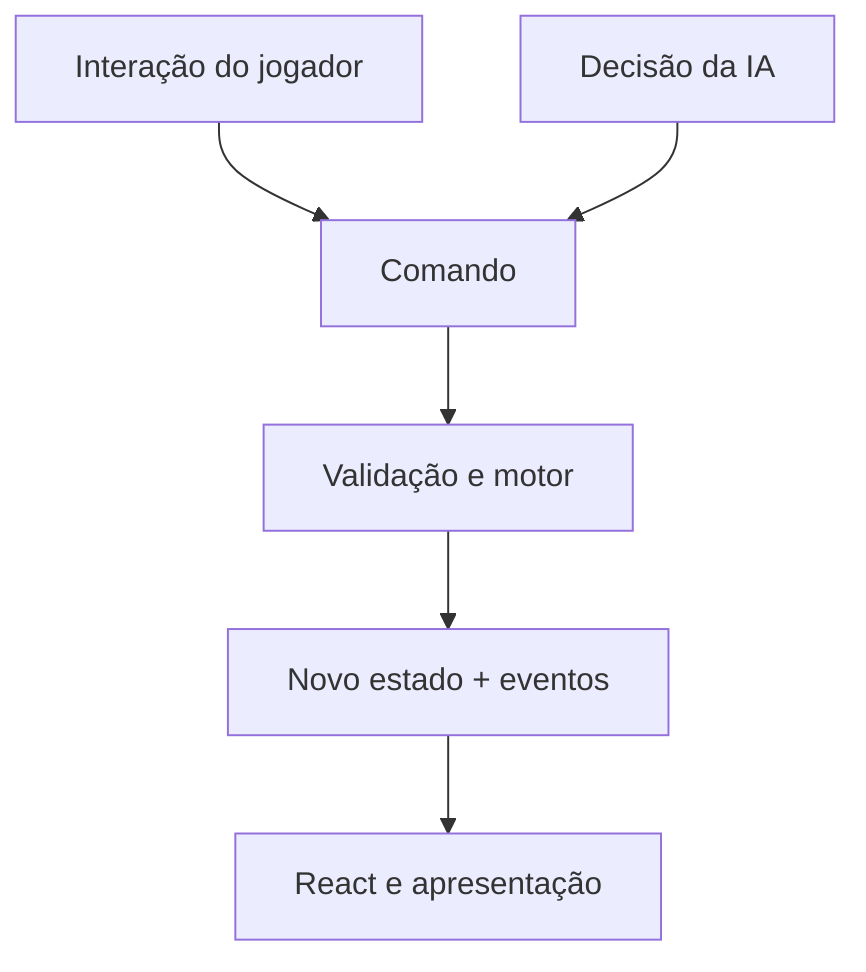
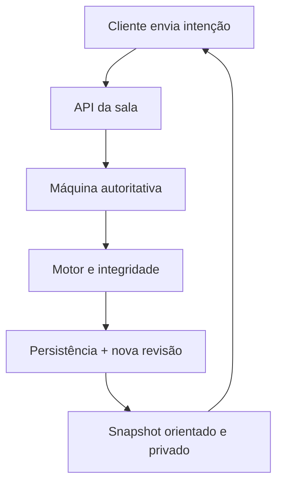

# Arquitetura do Hemsfell Heroes

Este documento descreve a arquitetura que existe hoje e a direção segura de evolução. Ele não redefine regras do jogo: decisões de design, documentos de prioridade/palavras-chave e testes continuam sendo as fontes de verdade.

## Princípios

1. **Uma única autoridade de estado.** No Online 1x1, a sala no servidor valida o comando e publica a nova revisão. No PvAI, o motor local ocupa esse papel.
2. **A interface envia intenções.** Jogar carta, passar prioridade, escolher alvo e declarar combate são comandos; componentes React não devem fabricar um estado válido por conta própria.
3. **Regra e apresentação avançam separadamente.** O motor produz estado e eventos confirmados. Animações podem atrasar a representação visual, mas nunca a resolução autoritativa.
4. **Determinismo antes de conveniência.** O mesmo estado, seed e sequência de comandos devem produzir o mesmo resultado, permitindo testes, IA, reconexão e futuros replays.
5. **Catálogo imutável, instâncias mutáveis.** `cards.generated.json` descreve o modelo da carta; dano, marcadores, controle, vínculo e zona pertencem à instância durante a partida.

## Camadas atuais

| Camada | Responsabilidade | Entradas principais |
| --- | --- | --- |
| Model / Rules Engine | Estado, comandos, validação, custos, alvos, efeitos, triggers, combate, prioridade, integridade e IA | `app/rules-engine/` |
| Application / Session | Traduz interação em comando, mantém sessão, reconecta, orienta snapshots e liga eventos à apresentação | `app/page.tsx`, `app/match/`, `app/online-*.{mjs,tsx}`, `app/presentation-*.{ts,tsx}` |
| View / Presentation | Renderiza tabuleiro, menus, tutorial, feedback de fase/prioridade e animações | componentes React e CSS em `app/` |
| Data / Catalog | Modelos de cartas, regras explícitas, subtipos, heróis, glossário e conteúdo do tutorial | `app/cards.generated.json`, `card-rules.mjs`, `subtypes.mjs`, `hero-evolution.mjs`, `game-glossary.ts`, `tutorial-content.ts` |
| Infrastructure | Salas, persistência, validação de payload, catálogo PDF, scripts, CI e testes | `app/api/`, `db/`, `worker/`, `scripts/`, `tests/` |

### Model / Rules Engine

- `compiler.mjs` transforma texto/tags do catálogo em habilidades estruturadas.
- `engine-base.mjs` concentra primitivas de estado compartilhadas pelo motor.
- `engine-core.mjs` implementa o caminho principal de validação e execução de comandos.
- `engine.mjs` é a fachada instrumentada consumida pela aplicação e pelos testes.
- `effects.mjs` executa primitivas reutilizáveis; `card-rules.mjs` cobre exceções explícitas.
- `targeting.mjs` calcula e valida alvos sem depender da árvore React.
- `priority-state.mjs` mantém a máquina de prioridade e a pilha LIFO.
- `combat.mjs` resolve combate local; `online-combat*.mjs` preserva os checkpoints autoritativos online.
- `match-integrity.mjs` verifica invariantes antes/depois de transições sensíveis.
- `ai.mjs` escolhe intenções; não possui um segundo conjunto de regras.
- `simulator.mjs` executa partidas headless com limites contra loops.

### Application / Session

`app/page.tsx` ainda é um shell legado grande e deve ser tratado como fronteira de compatibilidade. Extrações futuras devem mover uma responsabilidade de cada vez, mantendo selectors, atributos DOM e ordem de side-effects.

- `app/match/use-priority-control.ts` coordena a preferência de controle na UI.
- `app/match/priority-control-policy.mjs` define Assistido e Full Control sem alterar a regra de prioridade.
- `app/online-session.mjs` mantém identidade e dados da sessão.
- `app/online-state-orientation.mjs` apresenta host/guest sob a perspectiva local sem revelar zonas privadas.
- `app/online-match-runtime.tsx` sincroniza revisões confirmadas.
- `app/online-reconnect-runtime.tsx` restaura a sessão após perda temporária de conexão.
- `app/presentation-event-bridge.tsx` converte diferenças confirmadas em eventos visuais.
- `app/presentation-interaction-runtime.tsx` coordena bloqueios exclusivamente visuais durante cues/animações.

### View / Presentation

- `app/layout.tsx` define a ordem global dos runtimes; essa ordem é um contrato.
- `app/page.tsx` renderiza o shell da partida e os menus existentes.
- `app/match/priority-ui.tsx` e `combat-animation.tsx` apresentam prioridade e combate.
- `app/tutorial-screen.tsx` renderiza os capítulos e ilustrações; `tutorial-content.ts` contém navegação e textos estruturados.
- `app/remote-card-art.tsx` renderiza cartas reais do PDF e mantém cache de documento/página.
- As folhas CSS históricas continuam importadas diretamente. Ordem de importação, classes, IDs e `data-*` usados por testes não devem mudar numa reorganização estrutural.

### Data / Catalog

- `cards.generated.json` é o catálogo gerado e preserva IDs/páginas estáveis.
- `card-rules.mjs` é a fonte explícita para cartas que não podem depender apenas do compilador genérico.
- `subtypes.mjs` normaliza subtipos.
- `hero-evolution.mjs` mantém requisitos e transições de evolução.
- `game-glossary.ts` é a fonte canônica de texto curto e detalhado das palavras-chave na interface.
- `tutorial-content.ts` deriva exemplos de palavras-chave do glossário para impedir divergência de texto.

### Infrastructure

- `app/api/rooms/machine.ts` é a máquina autoritativa da sala Online 1x1.
- `app/api/rooms/store.ts` persiste revisões em memória, Supabase ou Vercel Blob e protege zonas privadas.
- `app/api/rooms/validation.ts` aplica limites e saneamento de payload.
- `app/api/hemsfell-card-catalog.pdf/route.ts` fornece o PDF usado por `RemoteCardArt`.
- `tests/` cobre motor, multiplayer, contratos estáticos da interface e fluxos do tutorial.
- `scripts/` contém auditoria de cartas, simulação e validação de build/artefato.

## Fluxo de comando

### PvAI/local



O estado do motor local é autoritativo. A IA usa as mesmas ações legais e o mesmo caminho de execução que o jogador.

### Online 1x1



O cliente não confirma a própria ação. A interface apresenta o snapshot da nova revisão; conflitos de revisão são rejeitados e sincronizados novamente.

## Turno, prioridade e pilha

O turno segue preparação/mulligan e então Manutenção → Principal → Combate → Finalização. Combate possui checkpoints próprios. Uma janela de resposta registra jogador com prioridade, passes consecutivos e pilha pendente.

- Ao adicionar uma ação respondível, a prioridade passa conforme a política definida nos documentos de prioridade.
- Uma ação válida zera a sequência de passes.
- Dois passes consecutivos resolvem somente o topo da pilha.
- Triggers produzidos pela resolução podem abrir uma nova janela.
- Assistido pode passar automaticamente quando não existe resposta legal; Full Control mantém as janelas pertencentes ao jogador.

Consulte [fluxo de prioridade online](online-priority-flow-rework.md) e [implementação de prioridade](online-priority-implementation.md) antes de alterar esse caminho.

## Direção de dependências

Dependências desejadas apontam para dentro:

```text
View -> Application / Session -> Model / Rules Engine <- Data / Catalog
                  Infrastructure -> Model / Rules Engine
```

O motor não importa componentes React, CSS, timers de animação ou APIs de navegador. A apresentação pode ler eventos confirmados, mas não pode ser necessária para concluir uma resolução.

## Como extrair código com segurança

1. Identifique um contrato observável: comando, retorno, evento, selector, classe, ID, atributo ou ordem de chamada.
2. Registre esse contrato num teste antes da movimentação quando ele ainda não estiver coberto.
3. Extraia uma responsabilidade sem mudar dados, timing ou ordem de side-effects.
4. Mantenha um ponto de compatibilidade no caminho antigo quando consumidores ou testes dependem dele.
5. Execute testes do domínio, typechecks e build.
6. Faça uma segunda PR caso a mudança também altere comportamento.

As superfícies congeladas e os limites específicos da refatoração de front-end estão em [frontend-structure-refactor.md](frontend-structure-refactor.md).
